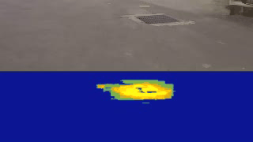
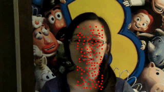

 

<strong> Pavement Distress Detection via Deep Learning </strong> 
  J. L. Yin, T. H. Peng, and J. L. Kuan
  [[Paper]](https://ieeexplore.ieee.org/abstract/document/9015591) | [[Media]](http://yzunews.yzu.edu.tw/national-college-college-open-source-software-program-creative-design-competition/)
 
 
 

<strong> AI System for Detecting Distracted Driving Behaviors </strong> 
  Y. T. Pang, S. W. Syu, Y. C. Huang
  [[Paper]](https://ieeexplore.ieee.org/document/8574512) 
 
 
 

<strong>Emotion Recognition for Driver Monitoring System</strong> 
  Y. L. Wu, H. Y. Tsai, and Y. C. Huang
  [[Paper]](https://ieeexplore.ieee.org/document/8574610) 
 
 
 

<strong>Easy3D: A Holographic Advertising Platform</strong> 
  S. Y. Lai 
  [[Paper]](https://ieeexplore.ieee.org/document/8574875) | [[Demo]](https://www.youtube.com/watch?v=7iHxskBOj4U) | [[Media]](http://yzunews.yzu.edu.tw/archimedes-international-invention-exhibition/)
 
 
 

<strong>Crowdsourcing-Based Framework for On-Road Weather Detection</strong> 
  C. C. Gao
  [[Code]](https://github.com/bigmms/Weather-Map)
 
 
 

<strong>ROI-based Video Stabilization</strong> 
  Y. J. Huang and Y. X. Wu 
  [App] | [Code]
 

